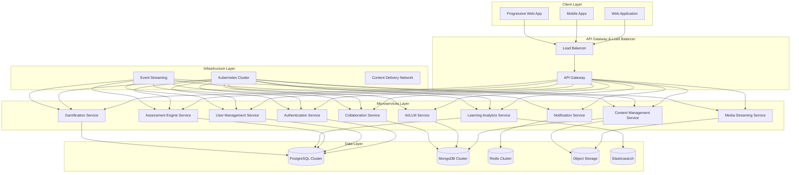

# Design Document

## Overview

The Enhanced Educational Platform is designed as a cloud-native, microservices-based system that can scale from hundreds to millions of users while maintaining high performance and reliability. The architecture emphasizes horizontal scalability, fault tolerance, and extensibility to support future growth and technological evolution.

The platform serves multiple user segments through role-based interfaces while providing AI-powered personalization, comprehensive analytics, and emerging technology integration capabilities.

## Architecture

### High-Level Architecture



### Microservices Architecture

#### Core Services

**Authentication & Authorization Service**
- JWT-based authentication with refresh token rotation
- OAuth 2.0 and SAML 2.0 support for SSO
- FIDO2/WebAuthn for passwordless authentication
- Role-based and attribute-based access control
- Multi-factor authentication with pluggable providers
- Session management with distributed caching

**User Management Service**
- User profile and preference management
- Hierarchical role assignment and permissions
- Multi-tenant organization support
- User activity tracking and audit logs
- GDPR compliance with data portability
- Bulk user operations and CSV import/export

**Content Management Service**
- Headless CMS with API-first design
- Version control and content lifecycle management
- Multi-format content support (SCORM, xAPI, IMS)
- Collaborative editing with real-time synchronization
- Content tagging and metadata management
- Automated content optimization and compression

**Assessment Engine Service**
- Pluggable question type architecture
- Adaptive testing algorithms with item response theory
- Distributed auto-grading with ML-based essay evaluation
- Plagiarism detection with similarity analysis
- Rubric-based assessment and peer review workflows
- Real-time proctoring integration capabilities

**Learning Analytics Service**
- Multi-dimensional data processing pipeline
- Real-time and batch analytics processing
- Predictive modeling with ML/AI integration
- Custom dashboard and report generation
- Data warehouse with OLAP capabilities
- Privacy-preserving analytics with differential privacy

**AI/LLM Service**
- Multi-model LLM orchestration
- Context-aware response generation
- Domain-specific fine-tuning capabilities
- Multi-modal input processing (text, voice, image)
- Conversation state management
- Safety filtering and content moderation

#### Supporting Services

**Notification Service**
- Multi-channel delivery (email, SMS, push, in-app)
- Template management with localization
- Delivery scheduling and retry mechanisms
- Preference management and opt-out handling
- Analytics and delivery tracking
- Rate limiting and spam prevention

**Gamification Service**
- Achievement and badge management system
- Point calculation and leaderboard maintenance
- Challenge and quest orchestration
- Social features and peer recognition
- Blockchain integration for credential verification
- A/B testing for engagement optimization

**Collaboration Service**
- Real-time messaging and discussion forums
- Video conferencing integration
- Document collaboration with operational transforms
- Group formation and management
- Peer review and feedback systems
- Activity feeds and social learning features

**Media Streaming Service**
- Adaptive bitrate streaming
- Content transcoding and optimization
- CDN integration with edge caching
- Live streaming capabilities
- Interactive video features (annotations, quizzes)
- Analytics and engagement tracking

### Scalability Design Patterns

#### Horizontal Scaling
- Stateless service design with external session storage
- Database sharding strategies for user and content data
- Read replicas for query optimization
- Microservice auto-scaling based on metrics
- Load balancing with health checks and circuit breakers

#### Event-Driven Architecture
- Apache Kafka for event streaming and service communication
- Event sourcing for audit trails and data consistency
- CQRS (Command Query Responsibility Segregation) for read/write optimization
- Saga pattern for distributed transaction management
- Dead letter queues for error handling and retry logic

#### Caching Strategy
- Multi-level caching (application, database, CDN)
- Redis cluster for session and real-time data
- Content caching with intelligent invalidation
- Query result caching with TTL management
- Edge caching for global content delivery

## Components and Interfaces

### Frontend Components

#### Teacher Portal
```typescript
interface TeacherPortalComponents {
  dashboard: {
    analyticsWidgets: AnalyticsWidget[]
    quickActions: QuickActionPanel
    notifications: NotificationCenter
  }
  contentCreator: {
    lessonBuilder: AILessonBuilder
    assessmentBuilder: AssessmentCreator
    mediaLibrary: MediaManager
    collaborationTools: CollaborationInterface
  }
  studentManagement: {
    classroomView: ClassroomDashboard
    progressTracking: ProgressAnalytics
    communicationTools: MessageCenter
  }
}
```

#### Student Portal
```typescript
interface StudentPortalComponents {
  dashboard: {
    personalizedLayout: AdaptiveDashboard
    progressVisualization: ProgressTracker
    recommendations: AIRecommendations
  }
  learningInterface: {
    lessonViewer: InteractiveLessonPlayer
    exerciseSolver: ProblemSolvingInterface
    buddyAI: ChatbotInterface
    practiceModule: SelfPracticeTools
  }
  collaboration: {
    discussionForums: ForumInterface
    studyGroups: GroupCollaboration
    peerTutoring: PeerLearningTools
  }
}
```

### Backend Service Interfaces

#### Core Service APIs
```typescript
interface AuthenticationAPI {
  authenticate(credentials: LoginCredentials): Promise<AuthToken>
  refreshToken(token: RefreshToken): Promise<AuthToken>
  validateToken(token: string): Promise<TokenValidation>
  logout(token: string): Promise<void>
  setupMFA(userId: string, method: MFAMethod): Promise<MFASetup>
}

interface ContentManagementAPI {
  createContent(content: ContentData): Promise<Content>
  updateContent(id: string, updates: ContentUpdate): Promise<Content>
  getContent(id: string, version?: string): Promise<Content>
  searchContent(query: SearchQuery): Promise<SearchResults>
  publishContent(id: string): Promise<PublishResult>
}

interface AssessmentAPI {
  createAssessment(assessment: AssessmentData): Promise<Assessment>
  submitResponse(assessmentId: string, response: Response): Promise<SubmissionResult>
  gradeSubmission(submissionId: string): Promise<GradingResult>
  getResults(assessmentId: string, userId: string): Promise<AssessmentResults>
}
```

### Integration Interfaces

#### Third-Party Integration Framework
```typescript
interface IntegrationFramework {
  lmsIntegration: {
    scormPlayer: SCORMPlayerInterface
    ltiProvider: LTIProviderInterface
    xAPITracker: XAPITrackerInterface
  }
  videoConferencing: {
    zoomIntegration: ZoomSDKInterface
    teamsIntegration: TeamsSDKInterface
    meetIntegration: GoogleMeetInterface
  }
  paymentProcessing: {
    stripeGateway: StripeInterface
    paypalGateway: PayPalInterface
    subscriptionManager: SubscriptionInterface
  }
}
```

## Data Models

### Core Entity Models

#### User Management
```typescript
interface User {
  id: string
  email: string
  profile: UserProfile
  roles: Role[]
  preferences: UserPreferences
  organizations: OrganizationMembership[]
  createdAt: Date
  updatedAt: Date
}

interface UserProfile {
  firstName: string
  lastName: string
  avatar?: string
  timezone: string
  language: string
  learningStyle: LearningStyle
  demographics: Demographics
}

interface Role {
  id: string
  name: string
  permissions: Permission[]
  hierarchy: number
  organizationId?: string
}
```

#### Content Management
```typescript
interface Content {
  id: string
  title: string
  description: string
  type: ContentType
  metadata: ContentMetadata
  versions: ContentVersion[]
  tags: string[]
  status: ContentStatus
  authorId: string
  organizationId?: string
  createdAt: Date
  updatedAt: Date
}

interface ContentVersion {
  version: string
  data: ContentData
  changelog: string
  publishedAt?: Date
  isActive: boolean
}

interface Lesson extends Content {
  modules: LessonModule[]
  prerequisites: string[]
  learningObjectives: string[]
  estimatedDuration: number
  difficulty: DifficultyLevel
}
```

#### Assessment Models
```typescript
interface Assessment {
  id: string
  title: string
  description: string
  questions: Question[]
  settings: AssessmentSettings
  rubrics: Rubric[]
  contentId?: string
  createdBy: string
  organizationId?: string
  createdAt: Date
  updatedAt: Date
}

interface Question {
  id: string
  type: QuestionType
  content: QuestionContent
  options?: QuestionOption[]
  correctAnswer: any
  points: number
  difficulty: DifficultyLevel
  tags: string[]
}

interface AssessmentSubmission {
  id: string
  assessmentId: string
  userId: string
  responses: Response[]
  startedAt: Date
  submittedAt?: Date
  score?: number
  feedback?: Feedback[]
  status: SubmissionStatus
}
```

#### Analytics Models
```typescript
interface LearningAnalytics {
  userId: string
  contentId: string
  sessionId: string
  events: LearningEvent[]
  metrics: LearningMetrics
  timestamp: Date
}

interface LearningEvent {
  type: EventType
  data: EventData
  timestamp: Date
  context: EventContext
}

interface LearningMetrics {
  timeSpent: number
  completionRate: number
  engagementScore: number
  masteryLevel: number
  strugglingIndicators: string[]
}
```

### Database Schema Design

#### Relational Data (PostgreSQL)
- User management and authentication
- Role-based access control
- Assessment results and analytics
- Transactional data and audit logs
- Subscription and billing information

#### Document Storage (MongoDB)
- Content and lesson data
- User-generated content and discussions
- AI conversation history
- Flexible metadata and configurations
- Real-time collaboration documents

#### Caching Layer (Redis)
- Session management
- Real-time leaderboards
- Temporary data and locks
- Rate limiting counters
- Pub/sub for real-time features

## Error Handling

### Error Classification and Response Strategy

#### Service-Level Error Handling
```typescript
enum ErrorType {
  VALIDATION_ERROR = 'VALIDATION_ERROR',
  AUTHENTICATION_ERROR = 'AUTHENTICATION_ERROR',
  AUTHORIZATION_ERROR = 'AUTHORIZATION_ERROR',
  RESOURCE_NOT_FOUND = 'RESOURCE_NOT_FOUND',
  RATE_LIMIT_EXCEEDED = 'RATE_LIMIT_EXCEEDED',
  SERVICE_UNAVAILABLE = 'SERVICE_UNAVAILABLE',
  INTERNAL_SERVER_ERROR = 'INTERNAL_SERVER_ERROR'
}

interface ErrorResponse {
  error: {
    type: ErrorType
    message: string
    code: string
    details?: any
    timestamp: Date
    requestId: string
  }
}
```

#### Circuit Breaker Pattern
- Automatic service degradation during failures
- Fallback mechanisms for critical features
- Health check endpoints for monitoring
- Graceful degradation with reduced functionality
- Automatic recovery and service restoration

#### Distributed Error Tracking
- Centralized logging with correlation IDs
- Error aggregation and alerting
- Performance monitoring and APM integration
- User impact assessment and prioritization
- Automated incident response workflows

## Testing Strategy

### Multi-Level Testing Approach with Real Data Integration

#### Unit Testing
- Service-level unit tests with high coverage (>90%)
- Mock external dependencies and databases
- Test-driven development for critical components
- Automated test execution in CI/CD pipeline
- Performance benchmarking for critical functions

#### Integration Testing with Real Data Scenarios
- API contract testing between services using production-like data sets
- Database integration testing with anonymized production data snapshots
- Third-party service integration validation with live sandbox environments
- End-to-end workflow testing with realistic user journey simulations
- Cross-service data consistency validation with real transaction volumes

#### Real Data Testing Framework

**Production Data Sanitization Pipeline**
```typescript
interface DataSanitizationFramework {
  dataExtraction: {
    productionSnapshot: ProductionDataExtractor
    anonymization: PIIAnonymizer
    dataSubsetting: IntelligentDataSubsetter
    referentialIntegrity: DataConsistencyValidator
  }
  testDataGeneration: {
    syntheticDataGenerator: RealisticDataGenerator
    scenarioBasedData: UserJourneyDataCreator
    volumeTestData: ScalabilityDataGenerator
    edgeCaseData: BoundaryConditionGenerator
  }
  dataRefresh: {
    scheduledRefresh: AutomatedDataRefreshPipeline
    onDemandRefresh: ManualDataUpdateTrigger
    incrementalUpdates: DeltaDataSynchronizer
  }
}
```

**Real User Scenario Testing**
- Authentic student learning journey simulations with actual curriculum data
- Teacher workflow testing with real lesson plans and assessment materials
- Parent/guardian interaction testing with genuine student progress data
- Administrative workflow validation with realistic institutional data
- Multi-tenant testing with actual organization structures and permissions

#### Performance Testing with Production-Scale Data

**Load Testing with Real Data Volumes**
```typescript
interface ProductionScaleTestingConfig {
  userLoadSimulation: {
    concurrentUsers: number // 10K, 50K, 100K+ concurrent users
    userBehaviorPatterns: RealUserBehaviorProfiles
    geographicDistribution: GlobalUserDistribution
    deviceMixSimulation: DeviceTypeDistribution
  }
  dataVolumeSimulation: {
    contentLibrarySize: number // Millions of lessons, exercises, media files
    userGeneratedContent: number // Forums, discussions, submissions
    assessmentSubmissions: number // Concurrent grading and feedback
    analyticsEventVolume: number // Real-time learning event processing
  }
  networkConditionTesting: {
    bandwidthVariation: NetworkConditionSimulator
    latencySimulation: GeographicLatencyModeling
    mobileNetworkTesting: CellularConnectionSimulation
    offlineScenarioTesting: ConnectivityInterruptionHandling
  }
}
```

**Stress Testing with Real-World Scenarios**
- Peak enrollment period simulation (back-to-school, semester start)
- Exam period load testing with simultaneous assessment submissions
- Live streaming events with thousands of concurrent viewers
- System recovery testing after real failure scenarios
- Database failover testing with production-equivalent data volumes

#### Data-Driven User Acceptance Testing

**Real User Behavior Simulation**
```typescript
interface RealUserTestingFramework {
  userPersonaSimulation: {
    k12Students: K12LearningPatterns
    higherEdStudents: UniversityLearningBehaviors
    corporateLearners: ProfessionalLearningPatterns
    teachers: EducatorWorkflowPatterns
    administrators: AdminTaskPatterns
  }
  contentInteractionTesting: {
    lessonEngagement: RealContentConsumptionPatterns
    assessmentBehavior: AuthenticTestTakingBehaviors
    collaborationPatterns: GenuineStudentInteractions
    aiChatbotUsage: RealConversationFlows
  }
  temporalPatternTesting: {
    dailyUsagePatterns: TimeBasedActivitySimulation
    seasonalVariations: AcademicCalendarImpactTesting
    weekendVsWeekdayBehavior: UsagePatternVariations
    timeZoneDistribution: GlobalUsagePatternTesting
  }
}
```

**A/B Testing with Real User Cohorts**
- Feature rollout testing with actual user segments
- UI/UX optimization with real user feedback loops
- Learning algorithm effectiveness with genuine learning outcomes
- Gamification impact measurement with authentic engagement metrics
- Personalization algorithm validation with real learning preferences

#### Data Quality and Integrity Testing

**Real Data Validation Framework**
```typescript
interface DataQualityTestingFramework {
  dataIntegrityValidation: {
    crossServiceConsistency: DataConsistencyValidator
    auditTrailVerification: ComplianceDataValidator
    dataRetentionCompliance: RetentionPolicyValidator
    privacyComplianceCheck: GDPRFERPAValidator
  }
  learningAnalyticsValidation: {
    progressTrackingAccuracy: LearningProgressValidator
    predictiveModelAccuracy: MLModelPerformanceValidator
    recommendationQuality: RecommendationEffectivenessValidator
    engagementMetricsValidation: EngagementDataValidator
  }
  contentQualityAssurance: {
    contentAccessibilityValidation: WCAGComplianceValidator
    multiLanguageContentTesting: LocalizationQualityValidator
    mediaQualityValidation: MultimediaContentValidator
    scormComplianceValidation: StandardsComplianceValidator
  }
}
```

#### Security Testing with Real Attack Scenarios

**Production-Like Security Testing**
- Penetration testing with realistic attack vectors
- Data breach simulation with actual data protection measures
- Authentication bypass attempts with real user credentials (anonymized)
- SQL injection and XSS testing with production-equivalent databases
- DDoS simulation with actual traffic patterns

#### Compliance Testing with Real Regulatory Scenarios

**Regulatory Compliance Validation**
```typescript
interface ComplianceTestingFramework {
  gdprCompliance: {
    dataPortabilityTesting: RealDataExportValidation
    rightToErasureTesting: DataDeletionValidation
    consentManagementTesting: ConsentWorkflowValidation
    dataProcessingAudit: ProcessingActivityValidation
  }
  ferpaCompliance: {
    educationalRecordProtection: StudentDataProtectionValidation
    parentalAccessRights: GuardianAccessValidation
    directoryInformationHandling: PublicDataHandlingValidation
    disclosureLogging: AccessAuditTrailValidation
  }
  coppaCompliance: {
    ageVerificationTesting: MinorProtectionValidation
    parentalConsentWorkflow: ConsentProcessValidation
    dataMinimizationTesting: ChildDataProtectionValidation
    safeHarborCompliance: SafetyMeasureValidation
  }
}
```

### Testing Infrastructure with Real Data Management

**Test Environment Management**
```typescript
interface TestEnvironmentFramework {
  environmentProvisioning: {
    productionMirrorEnvironments: ProductionCloneManager
    scalableTestInfrastructure: DynamicEnvironmentScaler
    dataRefreshAutomation: TestDataSynchronizer
    environmentIsolation: TenantIsolationValidator
  }
  testDataManagement: {
    dataLifecycleManagement: TestDataLifecycleManager
    sensitiveDataHandling: PIIProtectionManager
    dataVersioning: TestDataVersionControl
    dataCleanupAutomation: TestDataCleanupScheduler
  }
  monitoringAndObservability: {
    realTimeTestMetrics: TestExecutionMonitor
    performanceBaselining: PerformanceRegressionDetector
    errorTrackingAndAlerting: TestFailureAnalyzer
    testResultAnalytics: TestTrendAnalyzer
  }
}
```

### Continuous Testing Strategy with Real Data Integration

**Production-Informed Testing Pipeline**
- Automated test execution with production data snapshots on every commit
- Parallel test execution across multiple real-world scenarios
- Dynamic test environment provisioning with production-scale data
- Intelligent test data management with automated refresh cycles
- Regression testing with historical user journey patterns
- Performance baseline validation against production metrics
- Automated rollback triggers based on real user impact metrics

**Real-World Validation Metrics**
```typescript
interface RealWorldValidationMetrics {
  userExperienceMetrics: {
    realUserMonitoring: RUMMetrics
    coreWebVitals: WebPerformanceMetrics
    accessibilityCompliance: A11yValidationMetrics
    crossBrowserCompatibility: BrowserCompatibilityMetrics
  }
  businessImpactMetrics: {
    learningOutcomeValidation: EducationalEffectivenessMetrics
    engagementImpactMeasurement: UserEngagementMetrics
    retentionRateValidation: UserRetentionMetrics
    revenueImpactAssessment: BusinessMetrics
  }
  systemReliabilityMetrics: {
    uptimeValidation: SystemAvailabilityMetrics
    errorRateMonitoring: SystemReliabilityMetrics
    scalabilityValidation: SystemScalabilityMetrics
    securityPostureValidation: SecurityMetrics
  }
}
```

This enhanced testing strategy ensures that the platform is validated against real-world conditions, user behaviors, and data volumes, providing confidence that the system will perform effectively when deployed to production environments with actual users and authentic educational content.

This design provides a comprehensive, scalable foundation that can grow from a small educational platform to a global learning ecosystem while maintaining performance, reliability, and extensibility.