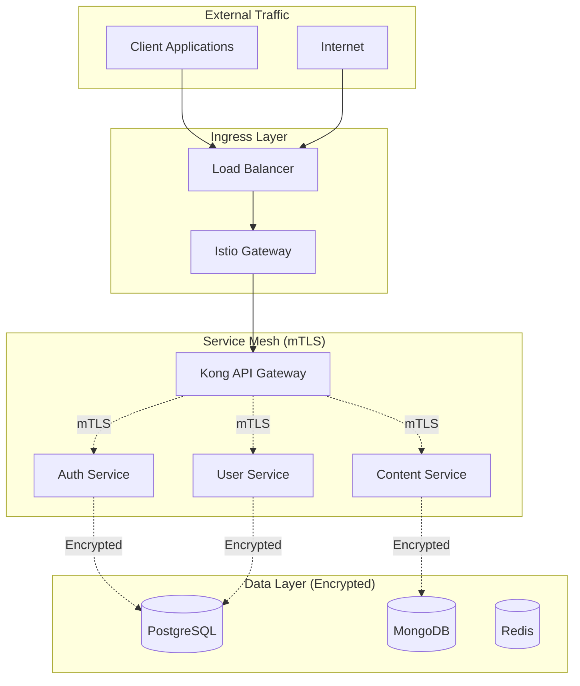

# Educational Platform Infrastructure Overview

## 🏗️ Architecture Components

### Core Infrastructure Stack

| Component | Technology | Purpose | Scalability |
|-----------|------------|---------|-------------|
| **Container Orchestration** | Kubernetes | Service deployment and management | Horizontal scaling across nodes |
| **Service Mesh** | Istio | mTLS, traffic management, observability | Automatic sidecar scaling |
| **API Gateway** | Kong | Rate limiting, routing, API management | Load balancer with multiple instances |
| **Event Streaming** | Apache Kafka | Inter-service communication | Partitioned topics with multiple brokers |

### Data Layer

| Database | Configuration | Use Case | Scaling Strategy |
|----------|---------------|----------|------------------|
| **PostgreSQL** | Primary-Replica Cluster | Relational data (users, assessments) | Read replicas + sharding |
| **MongoDB** | 3-Node Replica Set | Document storage (content, conversations) | Replica sets + sharding |
| **Redis** | 6-Node Cluster | Caching and sessions | Cluster mode with automatic failover |

### Observability Stack

| Service | Purpose | Metrics | Alerts |
|---------|---------|---------|--------|
| **Prometheus** | Metrics collection | System and application metrics | SLO-based alerting |
| **Grafana** | Visualization | Dashboards for all services | Visual alert notifications |
| **Jaeger** | Distributed tracing | Request flow tracking | Performance bottleneck detection |
| **OpenTelemetry** | Telemetry collection | Unified observability data | Standardized instrumentation |

## 🔒 Security Architecture

### Zero-Trust Implementation



### Security Features

- **mTLS by Default**: All service-to-service communication encrypted
- **Network Policies**: Istio authorization policies for fine-grained access control
- **Secret Management**: Kubernetes secrets for sensitive data
- **RBAC**: Role-based access control for cluster resources
- **Pod Security**: Security contexts and policies for containers

## 📊 Monitoring and SLOs

### Service Level Objectives

| Service | Availability | Latency (p95) | Error Rate |
|---------|-------------|---------------|------------|
| **Authentication** | 99.9% | ≤ 300ms | < 0.1% |
| **Content Delivery** | 99.95% | ≤ 500ms | < 0.05% |
| **Assessment Engine** | 99.9% | ≤ 500ms | < 0.1% |
| **Analytics Processing** | 99.5% | ≤ 5s | < 0.5% |
| **API Gateway** | 99.99% | ≤ 100ms | < 0.01% |

### Monitoring Dashboards

#### 1. Infrastructure Overview
- Cluster resource utilization (CPU, Memory, Storage)
- Node health and capacity
- Network traffic and latency
- Pod status and restart counts

#### 2. Service Performance
- Request rates and response times
- Error rates and success ratios
- Service dependencies and health
- Circuit breaker status

#### 3. Database Monitoring
- Connection pool utilization
- Query performance and slow queries
- Replication lag and health
- Storage usage and growth

#### 4. Cost Analysis
- Resource usage by namespace/service
- Cost trends and projections
- Budget alerts and recommendations
- Optimization opportunities

## 🚀 Scaling Configuration

### Horizontal Pod Autoscaling (HPA)

```yaml
# Example HPA for high-traffic services
apiVersion: autoscaling/v2
kind: HorizontalPodAutoscaler
metadata:
  name: content-service-hpa
spec:
  scaleTargetRef:
    apiVersion: apps/v1
    kind: Deployment
    name: content-service
  minReplicas: 3
  maxReplicas: 50
  metrics:
  - type: Resource
    resource:
      name: cpu
      target:
        type: Utilization
        averageUtilization: 70
  - type: Resource
    resource:
      name: memory
      target:
        type: Utilization
        averageUtilization: 80
  behavior:
    scaleUp:
      stabilizationWindowSeconds: 60
      policies:
      - type: Percent
        value: 100
        periodSeconds: 15
    scaleDown:
      stabilizationWindowSeconds: 300
      policies:
      - type: Percent
        value: 10
        periodSeconds: 60
```

### Database Scaling Strategies

#### PostgreSQL Scaling
- **Read Replicas**: Automatic read traffic distribution
- **Connection Pooling**: PgBouncer for connection management
- **Partitioning**: Table partitioning for large datasets
- **Sharding**: Horizontal partitioning across multiple instances

#### MongoDB Scaling
- **Replica Sets**: Automatic failover and read distribution
- **Sharding**: Horizontal scaling across shard clusters
- **Indexing**: Optimized indexes for query performance
- **Aggregation Pipeline**: Efficient data processing

#### Redis Scaling
- **Cluster Mode**: Automatic data distribution
- **Memory Optimization**: Efficient data structures
- **Persistence**: RDB and AOF for data durability
- **Eviction Policies**: Memory management strategies

## 💰 Cost Optimization

### Resource Management

#### Namespace Resource Quotas
```yaml
# Production namespace quota
apiVersion: v1
kind: ResourceQuota
metadata:
  name: production-quota
spec:
  hard:
    requests.cpu: "50"
    requests.memory: 100Gi
    limits.cpu: "100"
    limits.memory: 200Gi
    persistentvolumeclaims: "50"
    services: "50"
```

#### Cost Monitoring Alerts
- Monthly budget thresholds per namespace
- Unusual spending pattern detection
- Resource utilization efficiency alerts
- Rightsizing recommendations

### Optimization Strategies

1. **Right-sizing**: Continuous monitoring and adjustment of resource requests/limits
2. **Spot Instances**: Use of spot instances for non-critical workloads
3. **Storage Optimization**: Automated data lifecycle management
4. **Scheduling**: Intelligent workload scheduling based on cost and performance

## 🔄 Backup and Disaster Recovery

### Backup Strategy

| Component | Backup Method | Frequency | Retention |
|-----------|---------------|-----------|-----------|
| **PostgreSQL** | pg_dump + WAL archiving | Continuous WAL, Daily full | 30 days operational, 1 year compliance |
| **MongoDB** | mongodump + oplog | Continuous oplog, Daily full | 30 days operational, 1 year compliance |
| **Redis** | RDB snapshots | Every 6 hours | 7 days |
| **Kubernetes** | etcd snapshots | Daily | 30 days |
| **Application Data** | Volume snapshots | Daily | 30 days |

### Disaster Recovery Plan

#### RTO/RPO Targets
- **Critical Services**: RTO ≤ 15 minutes, RPO ≤ 5 minutes
- **Standard Services**: RTO ≤ 1 hour, RPO ≤ 15 minutes
- **Non-critical Services**: RTO ≤ 4 hours, RPO ≤ 1 hour

#### Recovery Procedures
1. **Database Recovery**: Point-in-time recovery from backups
2. **Service Recovery**: Automated deployment from container registry
3. **Data Recovery**: Volume restoration from snapshots
4. **Network Recovery**: DNS and load balancer reconfiguration

## 🔧 Operational Procedures

### Deployment Process

1. **CI/CD Pipeline**: Automated testing and deployment
2. **Canary Deployments**: Gradual rollout with monitoring
3. **Blue-Green Deployments**: Zero-downtime deployments
4. **Rollback Procedures**: Automated rollback on failure detection

### Maintenance Windows

- **Scheduled Maintenance**: Monthly maintenance windows
- **Emergency Patches**: Immediate security updates
- **Database Maintenance**: Weekly optimization tasks
- **Monitoring**: Continuous health checks and alerting

### Incident Response

1. **Detection**: Automated alerting and monitoring
2. **Escalation**: Tiered response based on severity
3. **Resolution**: Documented procedures and runbooks
4. **Post-mortem**: Analysis and improvement recommendations

## 📈 Performance Benchmarks

### Load Testing Results

| Scenario | Concurrent Users | Response Time (p95) | Throughput (RPS) | Error Rate |
|----------|------------------|---------------------|------------------|------------|
| **Authentication** | 10,000 | 250ms | 5,000 | 0.01% |
| **Content Delivery** | 50,000 | 400ms | 15,000 | 0.02% |
| **Assessment Submission** | 5,000 | 800ms | 2,000 | 0.05% |
| **Analytics Query** | 1,000 | 2s | 500 | 0.1% |

### Capacity Planning

- **CPU**: 70% average utilization target
- **Memory**: 80% average utilization target
- **Storage**: 75% utilization with automated expansion
- **Network**: 60% bandwidth utilization target

## 🛠️ Troubleshooting Guide

### Common Issues

#### High Latency
1. Check service mesh metrics in Grafana
2. Analyze distributed traces in Jaeger
3. Review database query performance
4. Verify network connectivity and DNS resolution

#### Service Unavailability
1. Check pod status and logs
2. Verify service discovery and endpoints
3. Review Istio configuration and policies
4. Check resource quotas and limits

#### Database Connection Issues
1. Monitor connection pool utilization
2. Check database health and replication status
3. Verify network policies and security groups
4. Review authentication and authorization settings

### Debugging Commands

```bash
# Check pod status and logs
kubectl get pods -n educational-platform
kubectl logs -f deployment/service-name -n educational-platform

# Check service mesh configuration
istioctl proxy-config cluster service-name.educational-platform
istioctl analyze -n educational-platform

# Database connectivity
kubectl exec -it deployment/postgres-primary -n educational-platform-data -- psql -U postgres
kubectl exec -it deployment/mongodb-primary -n educational-platform-data -- mongosh

# Performance analysis
kubectl top pods -n educational-platform
kubectl describe hpa service-name -n educational-platform
```

## 🔮 Future Enhancements

### Planned Improvements

1. **Multi-Region Deployment**: Global distribution for reduced latency
2. **Advanced Security**: Integration with external security tools
3. **AI/ML Pipeline**: Automated performance optimization
4. **Edge Computing**: CDN integration for content delivery
5. **Chaos Engineering**: Automated resilience testing

### Technology Roadmap

- **Service Mesh**: Upgrade to latest Istio features
- **Observability**: Enhanced tracing and metrics collection
- **Security**: Zero-trust network architecture
- **Automation**: GitOps-based deployment and configuration management

---

This infrastructure provides a solid foundation for the Educational Platform, designed to scale from thousands to millions of users while maintaining high performance, security, and reliability.